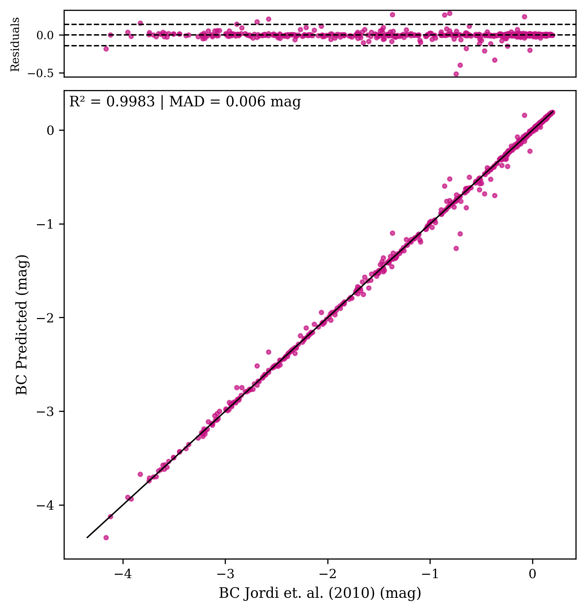
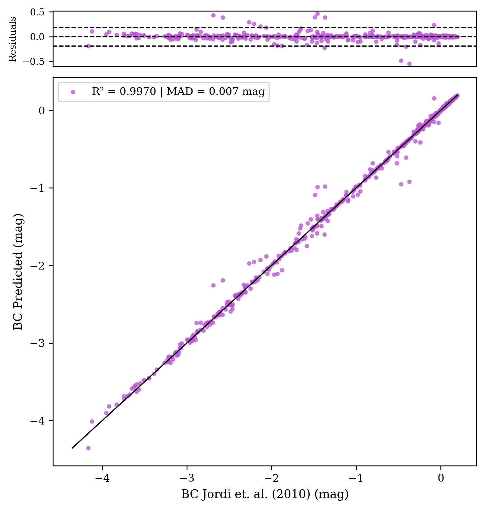

#
<p align="center">
  
</p>

# MINAS - Machine-learning INtegrated analysis with photometric Astronomical Surveys

[](https://badge.fury.io/py/minas)
[](https://pypi.org/project/minas/)
[](https://opensource.org/licenses/MIT)

MINAS was developed to assist and facilitate the complete Machine Learning workflow for astronomical photometric surveys. The package integrates all stages of the process, from preprocessing to final model application.

> **Fun fact:** MINAS is also the name of a Brazilian state (Minas Gerais), the home state of Icaro Meidem, the package creator. As a proud "mineiro" (someone from Minas Gerais), the name represents both the astronomical focus and personal heritage.

### Main Features
- **Complete workflow**: Integrates preprocessing, feature selection, hyperparameter tuning, and model application in a single package.
- **Random Forest and XGBoost integrated**: Optimized pipelines for classification and regression with the main ML libraries, easily extensible to other algorithms.
- **Intelligent feature selection**: Uses Permutation Importance to automatically identify the most relevant features.
- **Hyperparameter tuning**: Built-in tools for model optimization with grid search and random search.
- **Monte Carlo application**: Photometric error propagation using Monte Carlo simulations during prediction.
- **Automatic filter recognition**: Native support for filters from major photometric surveys such as J-PAS, J-PLUS, S-PLUS, GAIA, WISE, GALEX.
- **Bolometric correction**: Pre-trained models for bolometric correction calculation based on Teff, log g, and [Fe/H].
- **Modular structure**: Easy to adapt, extend, and integrate new methods or databases.

### Folder Structure

- `evaluation/`  
  Tools for model evaluation, metrics, plots, and feature selection (e.g., permutation importance).
- `models/`  
  Implementation of Random Forest, XGBoost models, and utilities for ML pipelines.
- `preprocess/`  
  Functions for data preprocessing, catalog manipulation, normalization, missing value handling, etc.
- `tuning/`  
  Methods for hyperparameter search (grid search, random search) and pipeline integration.
- `bolometric/`  
  Modules for classification and bolometric correction calculation with pre-trained models.
- `__init__.py`  
  Package initialization, filter definitions, parameter aliases, and submodule integration.
- `setup.py` and `pyproject.toml`  
  Configuration files for modern package installation (PEP 517/518).


### How to Use

Install the package (recommended):
```bash
pip install minas
```

> **Note:**
> In modern Python environments, editable mode (`-e`) may not work due to pip/setuptools changes. Prefer standard installation unless you really need live code editing.

Import in your code:
```python
import minas as mg
```

Usage example:
```python
from minas.models import create_model
model = create_model('RF-REG')
```

### Examples

The `examples/` folder contains complete Jupyter notebooks demonstrating the full ML workflow:

- **`data/`**: Data preparation and catalog creation
  - `data_creation.ipynb`: Creating training datasets from spectroscopic surveys
  - `apply/data/data_prepare.ipynb`: Preprocessing data for model application

- **`tuning/`**: Hyperparameter optimization and feature selection
  - `tuning_RF.ipynb` / `tuning_XGB.ipynb`: Grid search for optimal hyperparameters
  - `feature_import_RF.ipynb` / `feature_import_XGB.ipynb`: Permutation importance analysis
  - `pipeline/`: Custom pipeline configurations

- **`training/`**: Model training and evaluation
  - `predict_RF_all.ipynb` / `predict_XGB_all.ipynb`: Training models for Teff, log g, and [Fe/H]
  - `graphs_XGB_all.ipynb`: Visualization of results and performance metrics
  - `models/`: Saved trained models (XGB, RF)
  - `predicts/`: Prediction metrics and validation results
  - `graphs_results/`: Performance plots per parameter
  - `graphs_matrix/`: Confusion matrices and correlation plots

- **`apply/`**: Applying trained models to new data
  - `apply_models_XGB.ipynb` / `apply_models_RF.ipynb`: Model application with Monte Carlo error propagation
  - `pred_results/`: Final predictions with uncertainties

These notebooks provide a complete template for stellar parameter estimation from photometric data.

### Bolometric Correction

MINAS includes pre-trained models for calculating bolometric correction (BC) based on the corrections presented by Jordi et al. (2010), which provides BC data for Gaia-observed stars based on Teff, log g, and [Fe/H].

#### Available Models

Two Machine Learning algorithms were trained to predict bolometric correction:

| Model | R² | MAD | Standard Deviation |
|-------|-----|-----|-------------------|
| **Random Forest** | 0.9970 | 0.0067 mag | 0.0573 mag |
| **XGBoost** | 0.9983 | 0.0062 mag | 0.0430 mag |

#### Performance Plots

<p align="center">
  
  
</p>

*Figure: Performance of XGBoost (left) and Random Forest (right) models for bolometric correction prediction.*

#### How to Use

```python
import minas as mg

# Apply bolometric correction with XGBoost
df = mg.bolometric.apply_bc(
    data='your_catalog.csv',
    teff_col='Teff',
    logg_col='logg',
    feh_col='[M/H]',
    model_type='XGB',  # or 'RF'
    sigma_multiplier=3.0,  # Standard deviation multiplier for uncertainty
    output_file='catalog_with_bc.csv'
)
```

#### Uncertainties

BC uncertainty is calculated as `σ_BC = multiplier × standard_deviation`, where the multiplier is user-defined (default: 3.0). Statistics are automatically validated based on the validation sample included in the package, showing the percentage of objects within specified error limits.

#### Reference

Jordi, C., Gebran, M., Carrasco, J. M., et al. (2010). *Gaia broad band photometry*. Astronomy & Astrophysics, 523, A48. DOI: [10.1051/0004-6361/200913234](https://doi.org/10.1051/0004-6361/200913234)

### Extensibility
- You can add new ML algorithms by creating modules in `models/` and integrating them into the pipeline.
- New filters or surveys can be added by editing the `FILTERS` dictionary in `__init__.py`.

### Contribution
Pull requests and suggestions are welcome! Please follow the package's modularity and documentation standards.

### Author
- Icaro Meidem
- Contact: icarosilva@on.br

---

This package is distributed under the MIT license. For questions, open an issue in the repository.

If you use MINAS in your research, please cite the package and the grid(s) you used:

```bibtex
@software{meidem,
  author  = {Meidem, Icaro},
  title   = {{MINAS}: Machine-learning INtegrated analysis with photometric Astronomical Surveys},
  year    = {2025},
  url     = {https://github.com/icaromeidem/minas},
}
```
