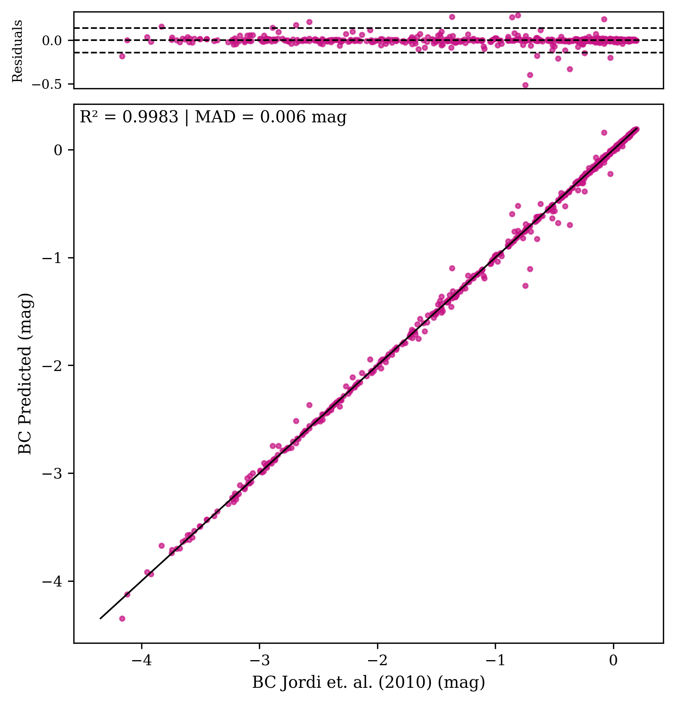
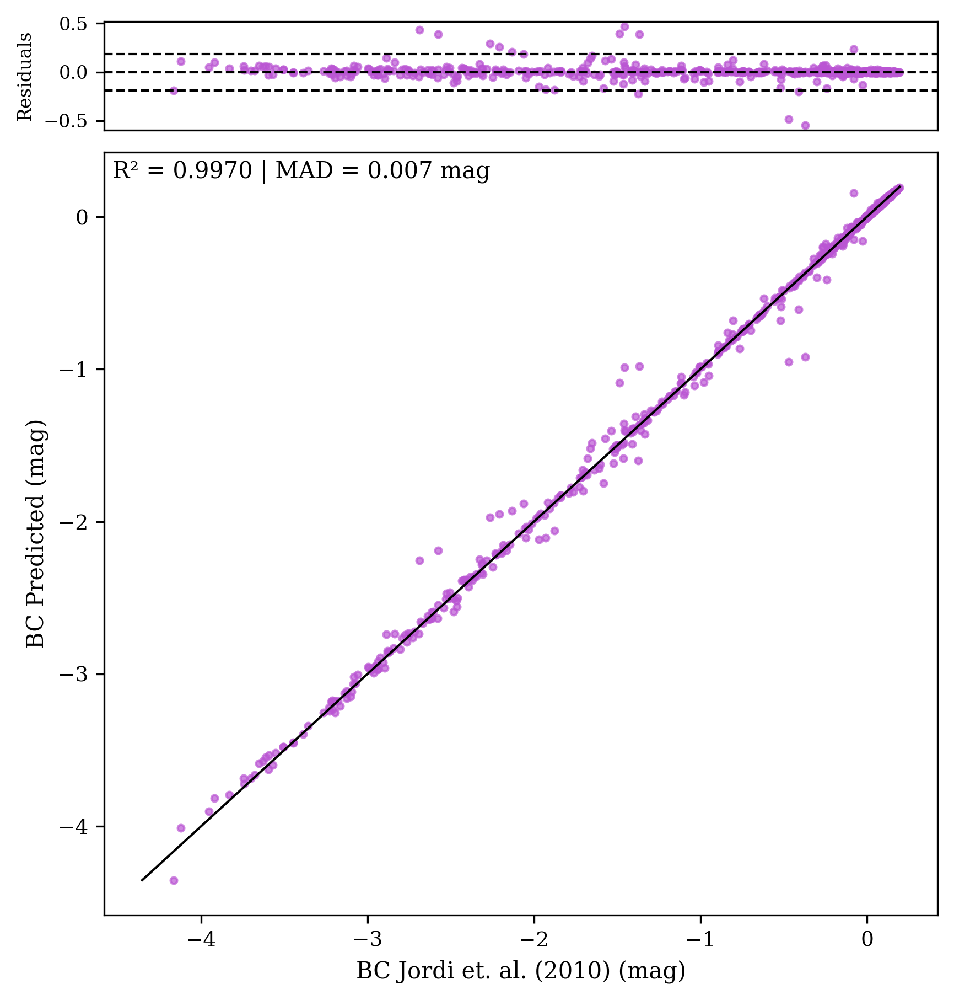

#
<p align="center">
  
</p>

# MINAS — Machine-learning INtegrated Analysis with photometric Astronomical Surveys

[](https://badge.fury.io/py/minas)
[](https://pypi.org/project/minas/)
[](https://opensource.org/licenses/MIT)
[](https://github.com/icaromeidem/minas/actions/workflows/tests.yml)

MINAS is a Python package for the complete Machine Learning workflow applied to photometric astronomical surveys. It integrates all stages — from preprocessing to final model application — in a single, modular interface.

> **Fun fact:** MINAS is also the name of a Brazilian state (Minas Gerais), the home state of Icaro Meidem, the package creator. As a proud *mineiro*, the name represents both the astronomical focus and personal heritage.

---

## Installation

```bash
pip install minas
```

---

## Quick Start — Full ML Workflow

```python
import minas as mg

# 1. Load catalog
catalog = mg.read_csv('my_catalog.csv')

# 2. Assemble feature DataFrame (magnitudes + pairwise colors)
work_df = mg.preprocess.assemble_work_df(
    df=catalog,
    filters=mg.FILTERS['JPLUS'],
    correction_pairs=dict(zip(mg.FILTERS['JPLUS'], mg.CORRECTIONS['JPLUS'])),
    add_colors=True,
)

# 3. Select most important features
features, df_importance = mg.evaluation.get_important_features(
    X=work_df,
    y=catalog['Teff'],
    n_features_to_save=20,
)
work_df = work_df[features]

# 4. Tune hyperparameters
param_dist = {
    'selectkbest__k'                         : [10, 15, 20],
    'randomforestregressor__n_estimators'    : [100, 300, 500],
    'randomforestregressor__min_samples_leaf': [1, 5, 10],
    'randomforestregressor__max_features'    : ['sqrt', 'log2'],
    'randomforestregressor__bootstrap'       : [True, False],
}
best_pipeline, search = mg.hyperparameter_search(
    X=work_df,
    Y=catalog['Teff'],
    model_type='RF',
    param_dist=param_dist,
    tuning_id='teff_rf',
    n_iter=30,
    save_dir='pipelines/',
)

# 5. Apply model with Monte Carlo error propagation
predictor = mg.models.Predictor(
    id_col='ID',
    mag_cols=mg.FILTERS['JPLUS'],
    err_cols=mg.ERRORS['JPLUS'],
    dist_col=None,
    correction_pairs=dict(zip(mg.FILTERS['JPLUS'], mg.CORRECTIONS['JPLUS'])),
    models={'Teff': best_pipeline},
    mc_reps=100,
    batch_partitions=10,
)
predictor.predict_parameters((catalog, 'results/teff_predictions.csv', ['ID'], 'w', True))
```

---

## Bolometric Correction

MINAS includes pre-trained models for bolometric correction (BC) based on
Jordi et al. (2010), trained on Gaia-observed stars using Teff, log g, and [Fe/H].

### Model Performance

| Model | R² | MAD | Std Deviation |
|-------|----|-----|---------------|
| **XGBoost** | 0.9983 | 0.0062 mag | 0.0430 mag |
| **Random Forest** | 0.9970 | 0.0067 mag | 0.0573 mag |

<p align="center">
  
  
</p>

*Figure: Performance of XGBoost (left) and Random Forest (right) for bolometric correction prediction.*

### Usage

```python
import minas as mg

df = mg.bolometric.apply_bc(
    data='catalog.csv',
    teff_col='Teff',
    logg_col='logg',
    feh_col='[M/H]',
    model_type='XGB',        # 'XGB' or 'RF'
    sigma_multiplier=3.0,    # uncertainty = multiplier x STD
    output_file='catalog_bc.csv',
)

print(df[['Teff', 'BC_pred', 'err_BC_pred']].head())
```

### Reference

Jordi, C. et al. (2010). *Gaia broad band photometry*. A&A 523, A48.
DOI: [10.1051/0004-6361/200913234](https://doi.org/10.1051/0004-6361/200913234)

---

## Supported Surveys and Filters

MINAS provides built-in filter definitions for the following photometric surveys.
All filter lists are accessible via `mg.FILTERS`, `mg.ERRORS`, and `mg.CORRECTIONS`.

| Survey | Filters | `mg.FILTERS` key |
|--------|---------|-----------------|
| **J-PLUS** | uJAVA, J0378, J0395, J0410, J0430, gSDSS, J0515, rSDSS, J0660, iSDSS, J0861, zSDSS | `'JPLUS'` |
| **S-PLUS** | uJAVA, J0378, J0395, J0410, J0430, gSDSS, J0515, rSDSS, J0660, iSDSS, J0861, zSDSS | `'SPLUS'` |
| **J-PAS** | uJAVA + 56 narrow bands (J0378-J1007) + iSDSS | `'JPAS'` |
| **WISE** | W1, W2, J, H, K | `'WISE'` |
| **GALEX** | NUVmag | `'GALEX'` |
| **Gaia** | G, BP, RP | `'GAIA'` |

```python
import minas as mg

print(mg.FILTERS['JPLUS'])      # magnitude column names
print(mg.ERRORS['JPLUS'])       # photometric error column names
print(mg.CORRECTIONS['JPLUS'])  # extinction correction column names
```

---

## Model Comparison — RF vs XGBoost

| Feature | Random Forest | XGBoost |
|---------|--------------|---------|
| Pipeline steps | Imputer → SelectKBest → RF | SelectKBest → XGB |
| Missing value handling | Built-in (median imputation) | Must be handled externally |
| Training speed | Moderate | Fast |
| Typical accuracy | Good | Excellent |
| Model key | `'RF-REG'` / `'RF-CLA'` | `'XGB-REG'` / `'XGB-CLA'` |
| Saved format | `.sav` (joblib) | `.json` |

```python
import minas as mg

# Default models
rf_model  = mg.models.create_model('RF-REG')
xgb_model = mg.models.create_model('XGB-REG')

# With tuned hyperparameters
hp = (0.8, 0.05, 6, 500, 0.8, 0.1)  # colsample, lr, depth, n_est, subsample, gamma
xgb_tuned = mg.models.create_model('XGB-REG', hp_combination=hp)
```

---

## Package Structure

```
minas/
├── preprocess/     magnitude correction, color creation, work DataFrame assembly
├── models/         ML pipeline factory (RF, XGB) and Monte Carlo predictor
├── tuning/         hyperparameter search with RandomizedSearchCV
├── evaluation/     metrics (MAD, R2), plots, feature importance
└── bolometric/     bolometric correction with pre-trained models
```

### Key Functions

| Function | Description |
|----------|-------------|
| `mg.preprocess.assemble_work_df()` | Build feature DataFrame from magnitudes |
| `mg.preprocess.correct_magnitudes()` | Apply extinction corrections |
| `mg.preprocess.calculate_abs_mag()` | Convert apparent to absolute magnitudes |
| `mg.models.create_model()` | Create RF or XGBoost pipeline |
| `mg.models.Predictor` | Monte Carlo predictor with uncertainty estimation |
| `mg.hyperparameter_search()` | RandomizedSearchCV for RF or XGB |
| `mg.evaluation.get_important_features()` | Impurity-based feature importance (RF) |
| `mg.evaluation.get_permutation_importance_rf()` | Permutation importance (RF) |
| `mg.evaluation.get_permutation_importance_xgb()` | Permutation importance (XGB) |
| `mg.evaluation.calculate_mad()` | MAD per bin |
| `mg.evaluation.plot_test_graphs()` | Scatter + KDE error plot |
| `mg.evaluation.plot_comparison_graph()` | Bar chart comparison across models |
| `mg.bolometric.apply_bc()` | Apply pre-trained bolometric correction model |

---

## Examples

The `examples/` folder contains complete Jupyter notebooks covering the full workflow:

| Folder | Contents |
|--------|----------|
| `data/` | Catalog creation and preprocessing |
| `tuning/` | Hyperparameter search and feature importance |
| `training/` | Model training, evaluation, and visualization |
| `apply/` | Model application with Monte Carlo error propagation |

---

## Citation

If you use MINAS in your research, please cite:

```bibtex
@software{minas,
  author  = {Meidem, Icaro},
  title   = {{MINAS}: Machine-learning INtegrated Analysis with photometric Astronomical Surveys},
  year    = {2025},
  url     = {https://github.com/icaromeidem/minas},
}
```

**Bolometric correction reference:**

- Jordi, C. et al. (2010), A&A 523, A48 — [doi:10.1051/0004-6361/200913234](https://doi.org/10.1051/0004-6361/200913234)

---

## License

MIT © Icaro Meidem