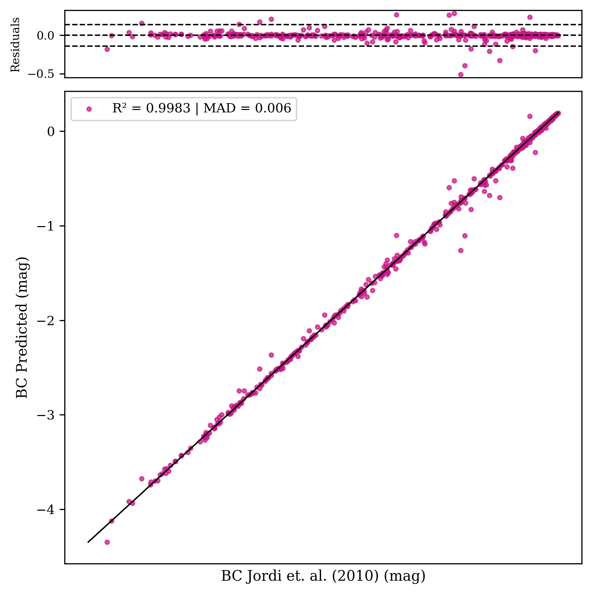
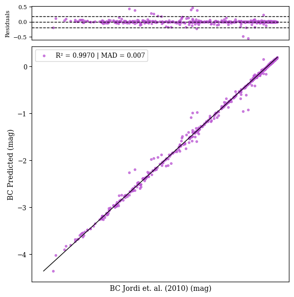

#
<p align="center">
  
</p>

# MINAS - Machine learning for INference with Astronomical Surveys

## Português

MINAS é uma versão otimizada e expandida do pacote Astropack (cordeirossauro/astropack), desenvolvida para facilitar análises de Machine Learning em levantamentos fotométricos astronômicos, especialmente com Random Forest e XGBoost, mas com estrutura flexível para incorporar outras técnicas.

### Principais Características
- **Baseado no Astropack**: Aproveita e expande funcionalidades do pacote original, com código otimizado e modular.
- **Foco em Random Forest e XGBoost**: Pipelines prontos para classificação e regressão, mas facilmente extensível para outros algoritmos.
- **Reconhecimento automático de filtros**: Suporte nativo aos filtros dos principais levantamentos fotométricos, como J-PAS, J-PLUS, S-PLUS, GAIA, WISE, GALEX.
- **Pré-processamento, tuning, avaliação e seleção de features**: Ferramentas integradas para todo o fluxo de trabalho em ML astronômico.
- **Estrutura modular**: Fácil de adaptar, estender e integrar novos métodos ou bancos de dados.

### Estrutura das Pastas

- `evaluation/`  
  Ferramentas para avaliação de modelos, métricas, gráficos e seleção de features (ex: permutation importance).
- `models/`  
  Implementação dos modelos Random Forest, XGBoost e utilitários para pipeline de machine learning.
- `preprocess/`  
  Funções para pré-processamento de dados, manipulação de catálogos, normalização, tratamento de valores ausentes, etc.
- `tuning/`  
  Métodos para busca de hiperparâmetros (grid search, random search) e integração com pipelines.
- `bolometric/`  
  Módulos para cálculo de correção bolométrica com modelos pré-treinados.
- `__init__.py`  
  Inicialização do pacote, definição de filtros reconhecidos, aliases de parâmetros e integração dos submódulos.
- `setup.py` e `pyproject.toml`  
  Arquivos de configuração para instalação do pacote no modo moderno (PEP 517/518).


### Correção Bolométrica

O MINAS inclui modelos pré-treinados para cálculo de correção bolométrica (BC) baseados nas correções apresentadas por Jordi et al. (2010), que fornece dados de BC para estrelas observadas pelo Gaia com base em Teff, log g e [Fe/H].

#### Modelos Disponíveis

Dois algoritmos de Machine Learning foram treinados para prever a correção bolométrica:

| Modelo | R² Score | MAD | Desvio Padrão |
|--------|-----|-----|---------------|
| **Random Forest** | 0.9970 | 0.0067 mag | 0.0573 mag |
| **XGBoost** | 0.9983 | 0.0062 mag | 0.0430 mag |

#### Gráficos de Desempenho

<p align="center">
  
  
</p>

*Figura: Desempenho dos modelos XGBoost (esquerda) e Random Forest (direita) para predição de correção bolométrica.*

#### Como Usar

```python
import minas as mg

# Aplicar correção bolométrica com XGBoost
df = mg.bolometric.apply_bc(
    data='your_catalog.csv',
    teff_col='Teff',
    logg_col='logg',
    feh_col='[M/H]',
    model_type='XGB',  # ou 'RF'
    sigma_multiplier=3.0,  # Multiplicador do desvio padrão para incerteza
    output_file='catalog_with_bc.csv'
)
```

#### Incertezas

A incerteza da BC é calculada como `σ_BC = multiplicador × desvio_padrão`, onde o multiplicador é escolhido pelo usuário (padrão: 3.0). As estatísticas são validadas automaticamente com base na amostra de validação incluída no pacote, mostrando a porcentagem de objetos dentro dos limites de erro especificados.

#### Referência

Jordi, C., Gebran, M., Carrasco, J. M., et al. (2010). *Gaia broad band photometry*. Astronomy & Astrophysics, 523, A48. DOI: [10.1051/0004-6361/200913234](https://doi.org/10.1051/0004-6361/200913234)

### Como Usar


Instale o pacote normalmente:
```bash
pip install /caminho/para/minas
```

> **Nota:**
> Para ambientes modernos, a instalação editável (`-e`) pode não funcionar devido a mudanças no pip/setuptools. Prefira a instalação padrão, a menos que você realmente precise editar o código frequentemente.

Importe no seu código:
```python
import minas as mg
```

Exemplo de uso:
```python
from minas.models import create_model
model = create_model('RF')
```

### Extensibilidade
- Você pode adicionar novos algoritmos de ML criando módulos em `models/` e integrando ao pipeline.
- Novos filtros ou levantamentos podem ser adicionados editando o dicionário `FILTERS` no `__init__.py`.

### Contribuição
Pull requests e sugestões são bem-vindos! Siga o padrão de modularidade e documentação do pacote.

### Autor
- Icaro Meidem
- Contato: icarosilva@on.br


---

Este pacote é distribuído sob a licença MIT. Para dúvidas, abra uma issue no repositório.

---

## English

MINAS is an optimized and expanded version of the Astropack package (cordeirossauro/astropack), designed to facilitate Machine Learning analyses in astronomical photometric surveys, especially with Random Forest and XGBoost, but with a flexible structure to incorporate other techniques.

### Main Features
- **Based on Astropack**: Leverages and expands the original package's features, with optimized and modular code.
- **Focus on Random Forest and XGBoost**: Ready-to-use pipelines for classification and regression, but easily extensible to other algorithms.
- **Automatic filter recognition**: Native support for filters from major photometric surveys such as J-PAS, J-PLUS, S-PLUS, GAIA, WISE, GALEX.
- **Preprocessing, tuning, evaluation, and feature selection**: Integrated tools for the entire astronomical ML workflow.
- **Modular structure**: Easy to adapt, extend, and integrate new methods or databases.

### Folder Structure

- `evaluation/`  
  Tools for model evaluation, metrics, plots, and feature selection (e.g., permutation importance).
- `models/`  
  Implementation of Random Forest, XGBoost models, and utilities for ML pipelines.
- `preprocess/`  
  Functions for data preprocessing, catalog manipulation, normalization, missing value handling, etc.
- `tuning/`  
  Methods for hyperparameter search (grid search, random search) and pipeline integration.
- `bolometric/`  
  Modules for classification and bolometric correction calculation with pre-trained models.
- `__init__.py`  
  Package initialization, filter definitions, parameter aliases, and submodule integration.
- `setup.py` and `pyproject.toml`  
  Configuration files for modern package installation (PEP 517/518).


### Bolometric Correction

MINAS includes pre-trained models for calculating bolometric correction (BC) based on the corrections presented by Jordi et al. (2010), which provides BC data for Gaia-observed stars based on Teff, log g, and [Fe/H].

#### Available Models

Two Machine Learning algorithms were trained to predict bolometric correction:

| Model | R² | MAD | Standard Deviation |
|-------|-----|-----|-------------------|
| **Random Forest** | 0.9970 | 0.0067 mag | 0.0573 mag |
| **XGBoost** | 0.9983 | 0.0062 mag | 0.0430 mag |

#### Performance Plots

<p align="center">
  
  
</p>

*Figure: Performance of XGBoost (left) and Random Forest (right) models for bolometric correction prediction.*

#### How to Use

```python
import minas as mg

# Apply bolometric correction with XGBoost
df = mg.bolometric.apply_bc(
    data='your_catalog.csv',
    teff_col='Teff',
    logg_col='logg',
    feh_col='[M/H]',
    model_type='XGB',  # or 'RF'
    sigma_multiplier=3.0,  # Standard deviation multiplier for uncertainty
    output_file='catalog_with_bc.csv'
)
```

#### Uncertainties

BC uncertainty is calculated as `σ_BC = multiplier × standard_deviation`, where the multiplier is user-defined (default: 3.0). Statistics are automatically validated based on the validation sample included in the package, showing the percentage of objects within specified error limits.

#### Reference

Jordi, C., Gebran, M., Carrasco, J. M., et al. (2010). *Gaia broad band photometry*. Astronomy & Astrophysics, 523, A48. DOI: [10.1051/0004-6361/200913234](https://doi.org/10.1051/0004-6361/200913234)

### How to Use


Install the package (recommended):
```bash
pip install /path/to/minas
```

> **Note:**
> In modern Python environments, editable mode (`-e`) may not work due to pip/setuptools changes. Prefer standard installation unless you really need live code editing.

Import in your code:
```python
import minas as mg
```

Usage example:
```python
from minas.models import create_model
model = create_model('RF-REG')
```

### Extensibility
- You can add new ML algorithms by creating modules in `models/` and integrating them into the pipeline.
- New filters or surveys can be added by editing the `FILTERS` dictionary in `__init__.py`.

### Contribution
Pull requests and suggestions are welcome! Please follow the package's modularity and documentation standards.

### Author
- Icaro Meidem
- Contact: icarosilva@on.br

---

This package is distributed under the MIT license. For questions, open an issue in the repository.
